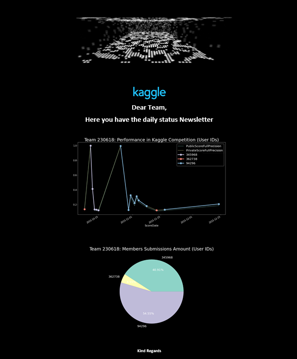

Auto Newsletter Tool
==========

This repository contains scripts to design mails content using HTML, analyze data in order to update the information and attach files and embed images containing the periodically updated info.

Main Contributions
------------------
* Embed Images in Mails (instead of attaching)
* Mailing Tasks Automatization
* Many simultaneous files attachable just by giving a list of Paths

Overview 
--------

This projects borns from a personal need of automating tedious recurrent mailing tasks.

The difference with other mailing repos is that the mails are completely customisable using HTML and allows:

1. **Embed images using HTML.** In a newsletter, people usually want the pictures to be displayed.
2. **Attach files giving a list of paths** adding contents to your reporting mail. You just have to declare where are them.
3. **Select Mailing Client**. Gmail, Outlook, ...
4. **Select a List of Destinataries**

Dependencies
------------

- All code is written in Python 3.
- Some code depends on the 'json' library:
  - Read User and Password from *Security* folder
- Some code depends on the 'email', 'smtp' and 'os' library:
  - SendEmail.py

Description of files
--------------------

Non-Python files:

filename                          |  description
----------------------------------|------------------------------------------------------------------------------------
README.md                         |  Text file (markdown format) description of the project.
src/*                             |  Attachable files and Images for embedding.
security/credentials.txt          |  Ignored plain text file containing a json with credentials. {"User":"user.name@mail.com", "Password":""}
Python scripts files:

filename                          |  description
----------------------------------|------------------------------------------------------------------------------------
lib/SendEmail.py                  |  Python Class for sending emails
lib/globals.py                    |  Blank File where you can declare your personal useful variables
database/plot_gen.py              |  Example python file where reported plots are created using Kaggle data and some python libraries

Kaggle Example
------------------------

In order to simulate controling the performance of a real Data Scientists Team, a portion of Kaggle team results data (*src/data/Submissions_sum.csv*) is used.

In *database/plot_gen.py* a concrete team is chosen in order to create 2 plots:

1. Time Series with competition scores (public and private) and how has each of the members of the team contributed to each score.

2. Pie Chart withthe amount of submissions per User ID.

This is just an example but possibilities are almost ulimited so I really encourage you to implement new applications and to share it with us.

**THANK YOU**
